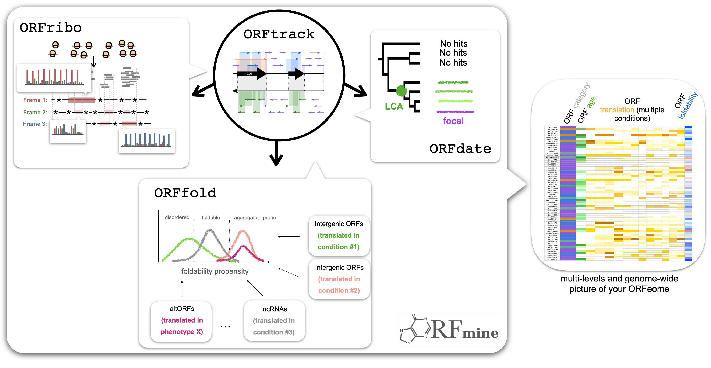

# ORFmine

<div align="center">
    
</div>

ORFmine is an open-source package that aims at extracting, annotating, and characterizing the sequence and structural properties of all Open Reading Frames (ORFs) of a genome, including coding as well as noncoding sequences, along with their translation activity. ORFmine consists of several independent programs that can be used together or independently:

<br>

- <i>ORFtrack searches for all possible ORFs longer than 60 nucleotides in the six frames of an input genome, and annotate them according to a set of genomic features</i>
- <i>ORFold predicts the fold potential and the disorder and aggregation propensities of a set of amino acid sequences</i>
- <i>ORFribo probes the translation activity of ORFs  based on Ribosome Profilng data (Ribo-Seq)</i>
- <i>ORFdate estimates the evolutionary of ORFs based on phylostratigraphy</i>

More information can be found in our full [documentation](https://i2bc.github.io/ORFmine/) pages.


## Requirements

ORFmine requires several dependencies and external softwares. To simplify installation, we offer a Docker image that includes the entire environment needed to use ORFmine: `nchenche/orfmine:v2.0.0`.


#### For a Docker usage (recommended)
To use the Docker image, you will need:
- Python >= 3.9
- ORFmine >= 2.0.0
- Docker
- Tango == 3.1 (optional, might be useful for orfold)
- IUPred2A (optional, might be useful for orfold)


#### For a fully local installation
Alternatively, if you want to set up your environment for a local usage of ORFmine:
- Python >= 3.9
- python dependencies (-> `pip3 install -r requirements.txt`)
- blast >= 2.13
- bowtie2 == 2.5.0
- hisat2 == 2.2.1
- gffread == 0.12.7
- samtools == 1.16.1
- FastQC == 0.11.9
- Tango == 3.1 (optional, might be useful for orfold)
- IUPred2A (optional, might be useful for orfold)


## Recommendation

Before installing ORFmine, we strongly recommend to set up an Python isolated environment in order to avoid potential version conflicts between python libraries when working on different projects or different ORFmine versions.

Click in the section below for a short illustration on how to use an Python isolated environment.

<details style="margin-left: 32px">
<summary>How to use an isolated environment (recommended)</summary>
<br>
<p>
By using an isolated environment you will avoid potential version conflicts between python libraries when working on different projects. Some of the most popular tools to work with isolated python environments are [virtualenv](https://pypi.org/project/virtualenv/), [pyenv](https://pypi.org/project/pyenv/), [pipenv](https://pypi.org/project/pipenv/). 
</p>

Below is an example on how to use [virtualenv](https://pypi.org/project/virtualenv/).

#### 1. Install virtualenv
```bash
# upgrade pip to its latest version
python3 -m pip install --upgrade pip

# install virtualenv
python3 -m pip install virtualenv
```

#### 2. Create and activate an isolated environment
```bash
# create an isolated environment named 'orfmine_env' (to adapt)
virtualenv orfmine_env

# activate your isolated environment
source orfmine_env/bin/activate
```

Once activated, any python library you'll install using pip will be installed in this isolated environment, and python will only have access to these packages.

Once you're done working on your project, simply type `deactivate` to exit the environment.
</details>


## Installation

> :bell: Important: The ORFmine package must be installed locally even if you plan to use the Docker image. This is because ORFmine includes a feature that simplifies the Docker usage, eliminating the need for complex volume mounting commands. For more details, see Usage with and without Docker.


ORFmine can be accessed in different ways. Follow instructions described in option 1 or 2 if you're not interested in accessing/modifying the source code, otherwise prefer option 3. 

<a id="install_option1"></a>
<details open>
<summary><h4>Option 1: from the archive (git not required)</h4></summary>

First download an archive of our latest release <a href="https://github.com/i2bc/ORFmine/releases/latest" target="_blank">here</a>.

```bash
# upgrade pip to its latest version
python3 -m pip install --upgrade pip

# install ORFmine vx.x.x
python3 -m pip install ORFmine-vx.x.x.zip # (or .tar.gz)
```
</details>


<details>
<summary><h4>Option 2: from the version control systems</h4></summary>

```bash
# upgrade pip to its latest version
python3 -m pip install --upgrade pip

# install ORFmine vx.x.x
python -m pip install -e git+https://github.com/i2bc/ORFmine.git@v2.0.0#egg=orfmine
```
</details>

<details>
<summary><h4>Option 3: from this project repository</h4></summary>

```bash
# clone ORFmine on your machine
git clone https://github.com/i2bc/ORFmine.git

# go in the ORFmine/ directory
cd ORFmine

# upgrade pip to its latest version
python3 -m pip install --upgrade pip

# install ORFmine in edition mode (useful for a development process)
python3 -m pip install -e .
```
</details>


## Documentation

Details about the four programs of ORFmine and their usage can be found in our full [documentation](https://i2bc.github.io/ORFmine/) pages.


## Licence

The ORFmine project is under the MIT licence. Please check [here](https://github.com/i2bc/ORFmine/blob/ORFmine_complete/LICENSE.md) for more details.


## References

1. Bitard-Feildel, T. & Callebaut, I. HCAtk and pyHCA: A Toolkit and Python API for the Hydrophobic Cluster Analysis of Protein Sequences. bioRxiv 249995 (2018).
2. Dosztanyi, Z., Csizmok, V., Tompa, P. & Simon, I. The pairwise energy content estimated from amino acid composition discriminates between folded and intrinsically unstructured proteins. Journal of molecular biology 347, 827–839 (2005).
3. Dosztányi, Z. Prediction of protein disorder based on IUPred. Protein Science 27, 331– 340 (2018).
4. Mészáros, B., Erdős, G. & Dosztányi, Z. IUPred2A: context-dependent prediction of protein disorder as a function of redox state and protein binding. Nucleic acids research 46, W329–W337 (2018).
5. Fernandez-Escamilla, A.-M., Rousseau, F., Schymkowitz, J. & Serrano, L. Prediction of sequence-dependent and mutational effects on the aggregation of peptides and proteins. Nature biotechnology 22, 1302–1306 (2004).
6. Linding, R., Schymkowitz, J., Rousseau, F., Diella, F. & Serrano, L. A comparative study of the relationship between protein structure and β-aggregation in globular and intrinsically disordered proteins. Journal of molecular biology 342, 345–353 (2004). 
7. Rousseau, F., Schymkowitz, J. & Serrano, L. Protein aggregation and amyloidosis: confusion of the kinds? Current opinion in structural biology 16, 118–126 (2006).

