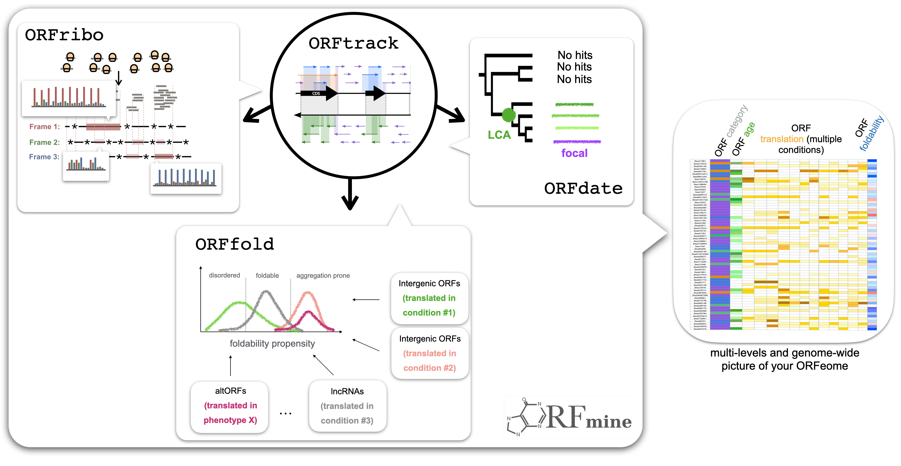

# ORFmine

<div align="center">
    
</div>

ORFmine is an open-source package that aims at extracting, annotating, and characterizing the sequence and structural properties of all Open Reading Frames (ORFs) of a genome, including coding as well as noncoding sequences, along with their translation activity. ORFmine consists of several independent programs that can be used together or independently:

- <i>**ORFtrack** searches for all possible ORFs longer than 60 nucleotides in the six frames of an input genome, and annotate them according to a set of genomic features.</i>
- <i>**ORFold** predicts the fold potential and the disorder and aggregation propensities of amino acid sequences.</i>
- <i>**ORFribo** probes the ORFs translation activity based on Ribosome Profiling data (Ribo-Seq).</i>
- <i>**ORFdate** estimates the ORFs evolutionary age based on phylostratigraphy information.</i>

More information can be found in the ORFmine [documentation](https://i2bc.github.io/ORFmine/).

---


## Requirements

ORFmine requires several dependencies and external softwares. To simplify installation, we offer a Docker image providing the complete environment required to use all of the ORFmine tools.

<details open>
<summary><h4>Minimal requirements for a container usage (recommended)</h4></summary>
To use the Docker image, you will need:

- Python >= 3.9
- ORFmine >= 2.0.0
- Docker or Singularity
</details>


## Recommendation

Before installing ORFmine, we strongly recommend to set up an Python isolated environment in order to avoid potential version conflicts between python libraries when working on different projects or different ORFmine versions.

Click in the section below for a short illustration on how to use an Python isolated environment.

<details style="margin-left: 32px">
<summary>How to use an isolated environment (recommended)</summary>
<br>
<p>
By using an isolated environment you will avoid potential version conflicts between python libraries when working on different projects. Some of the most popular tools to work with isolated python environments are [virtualenv](https://pypi.org/project/virtualenv/), [pyenv](https://pypi.org/project/pyenv/), [pipenv](https://pypi.org/project/pipenv/). 
</p>


## Quick Installation Guide

### Recommended Setup: Isolated Python Environment


```bash
python3.9 -m pip install --upgrade pip
python3.9 -m pip install virtualenv
virtualenv orfmine_env
source orfmine_env/bin/activate

```

To deactivate the environment:  

```bash
deactivate
```

### Installation Options

> :bell: **Note**
 The ORFmine package must be installed locally even if you plan to use the Docker image. This is because ORFmine includes a feature that simplifies the Docker usage, eliminating the need for complex volume mounting commands.


ORFmine can be accessed in different ways. Follow instructions described in option 1 or 2 if you're not interested in accessing/modifying the source code, otherwise prefer option 3. 


#### 1. From GitHub Releases
Download the latest release from [GitHub](https://github.com/i2bc/ORFmine/releases/latest) and install it:

```bash
python3.9 -m pip install ORFmine-vx.x.x.zip
```

#### 2. From GitHub Repository
Install directly from the repository:

```bash
python3.9 -m pip install -e git+https://github.com/i2bc/ORFmine.git@v3.0.0#egg=orfmine
```

#### 3. From Local Repository
Clone the repository and install locally:

```bash
git clone https://github.com/i2bc/ORFmine.git
cd ORFmine
python3.9 -m pip install -e .
```

---

## Containerized Usage (Docker or Singularity)

ORFmine is fully compatible with containerized environments. Use the Docker or Singularity options for hassle-free setup:

- **Docker**:  
```bash
$package_name $args --docker
```

- **Singularity**:  
```bash
$package_name $args --singularity
```

---

## Documentation

For detailed installation instructions, usage examples, and pipeline configurations, visit the full [ORFmine Documentation](https://orfmine-docs-link.com).

---

## License and Citation

**License**: ORFmine is licensed under the MIT License.  
**Citation**: If you use ORFmine in your research, please cite:

> Papadopoulos, C., Chevrollier, N., Lopes, A. Exploring the peptide potential of genomes. Meth. Mol. Biol. (2022).  
> Papadopoulos, C., et al. The Ribosome Profiling landscape of yeast reveals a high diversity in pervasive translation. bioRxiv (2023).
