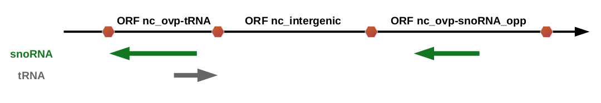

## ORF annotation

The ORF annotation relies on the comparison of its localization
with those of all the genetic features annotated in the input GFF 
file (e.g. coding sequences (CDS), tRNA, lncRNA, snoRNA, 
pseudogenes...). An ORF is subsequently assigned as coding (c_CDS)
(if it includes in the same frame a CDS or an exon for multiexonic 
genes) or noncoding (nc). Noncoding ORFs are then subdivided into 
noncoding intergenic ORFs (nc_intergenic) or noncoding overlapping 
ORFs (nc_ovlp_x with x refering to the overlapping genetic feature).
The former correspond to ORFs which do not overlap with any 
genetic feature. The latter consist of ORFs
which overlap with a genetic feature on the same or the opposite
strand or which overlap with a CDS or an exon in another frame. 
Depending on the localization of the overlapping feature (same or
opposite strand), the ORFs are annotated as nc_same_ovlp_x or 
nc_opp_ovlp_x respectively.

Notice that the ORFmap annotation adopts/has a particular point of
view on the genome which is centered on the identification and
annotation of a genome's ORFs rather than the annotation of 
real biological objets (e.g. tRNA, rRNA or lncRNA for example). 
ORFmap looks at the genome with a protein perspective where
the ORFs of a genome can be seen as its potential for novel peptides or 
proteins upon the pervasive translation of their corresponding RNAs.

### Non-coding ORF sequences

All GFF elements present in both strands are used to define if an ORF is overlapping or not. Thus, 
non-coding ORF sequences have three possible feature types:

* `nc_intergenic` if the ORF sequence has no overlapping GFF element
* `nc_ovp-element_type` if the ORF sequence overlaps with a GFF element in the same strand
* `nc_ovp-element_type-opp` if the ORF sequence overlaps with a GFF element in the opposite strand

For instance, if an ORF sequence overlaps with a tRNA, the ORF type will be `nc_ovp-tRNA`.

    

        Note
    

    

       Notice, that a noncoding ORF which overlaps with a tRNA is not 
considered as a tRNA and will not be annotated as tRNA, but rather
as an ORF that overlaps with a tRNA. Indeed a tRNA is a RNA 
molecule that does not follow the ORF definition (not bounded by STOP 
codons, sequence length is not necessarily a multiple of 3...).
An ORF can be seen as the potential peptide/protein that could be 
produced upon the pervasive translation of its corresponding RNA.
In other words, 
Annotating all ORFs with the genetic feature they overlap with 
enables their analysis in a very flexible fashion.
Indeed, the user can adopt different levels of annotation, 
considering all noncoding ORFs as a whole (regardless of the fact they
overlap with a genetic feature or not) or differentiating noncoding
intergenic ORFs from noncoding ORFs that overlap 

    

If an ORF sequence overlaps with multiple GFF elements, the one that will be considered to annotate 
the ORF is the one prioritized according to the following rules:

 1. an element on the same strand has the priority over an element on the opposite strand
   
 2. an element with which the ORF sequence overlaps the most has the priority over other elements
   
 3. the element appearing the first in the GFF file has the priority 
   

If an ORF sequence overlaps with multiple GFF elements, the ORF type will be assigned according to
the overlapping element with wich it overlaps the most. If the ORF overlaps equally with multiple 
elements, then it will be arbitrarily assigned according to the first element met in the GFF file.

 