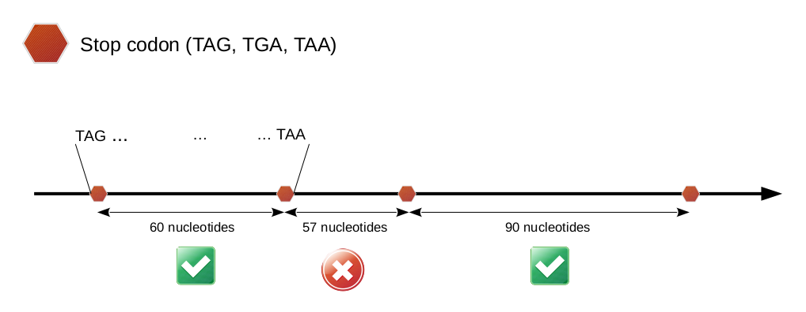

## ORF defintion

ORFMap searches in the 6 frames for all possible ORFs of a given genome. 
ORFs are defined according to the general definition (https://doi.org/10.1016/j.tig.2017.12.009).
An ORF:

 * has a length divisible by 3
 * is bounded by stop codons
 * is at least 60 nucleotides long (3' STOP codon included)

The minimal length of an ORF can be nevertheless modified by the user with
the XXXX parameter (notice that the ORF length includes the 3'
STOP codon). The following instruction extracts all ORFs of at least 
100 amino acids: 


``` python
orfold xxxx -ORF_length 303 
```



