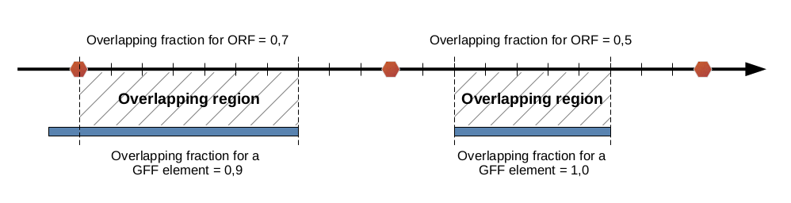

## Overlap definition

Calculation of the overlap:

* An ORF is considered to overlap with a given genetic feature
  if the latter covers at least 70 % of the ORF sequence.

* If less than 70 % of an ORF sequence overlaps with a genetic
   feature,
   but the latter is totally included in the ORF sequence, 
   then the ORF is also considered as overlapping with it ???
   ah bon ???. 

Notice that the overlap threshold can be modified with the XXXX
parameter. With the following instruction, an overlap of 90%
is used for the ORF annotation//an ORF is annotated as overlapping
with a given genetic feature if the latter covers at least 
90% of the considered ORF.


``` python
orfold xxxx -OVLP 90% 
```



