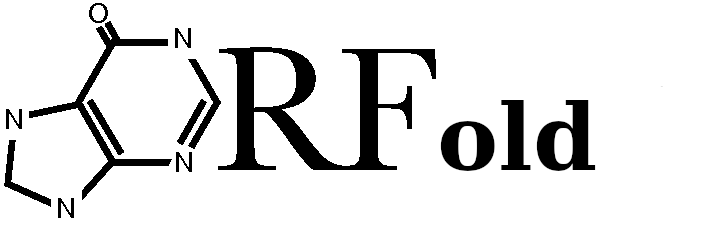

{ width=30% }
# Aims and general description of ORFold

ORFold aims at estimating the fold potential of a set of amino acid sequences
using the Hydrophobic Clusters Analysis (HCA) method [1]. 
We define the foldability of an amino acid sequence as its ability 
to fold to a stable 3D structure or to a molten globule state in which the specific 
tertiary structure is lost whereas the secondary structures are intact.

ORFold calculates the HCA foldability score of each given sequence. 
Furthermore, ORFold can estimate the 
disorder and/or aggregation propensities of the input sequences using 
the IUPred[2][3][4] and Tango[5][6][7] methods respectively.

   
#### References

1. Bitard-Feildel, T. & Callebaut, I. HCAtk and pyHCA: A Toolkit and Python API for the Hydrophobic Cluster Analysis of Protein Sequences. bioRxiv 249995 (2018).
2. Dosztanyi, Z., Csizmok, V., Tompa, P. & Simon, I. The pairwise energy content estimated from amino acid composition discriminates between folded and intrinsically unstructured proteins. Journal of molecular biology 347, 827–839 (2005).
3. Dosztányi, Z. Prediction of protein disorder based on IUPred. Protein Science 27, 331– 340 (2018).
4. Mészáros, B., Erdős, G. & Dosztányi, Z. IUPred2A: context-dependent prediction of protein disorder as a function of redox state and protein binding. Nucleic acids research 46, W329–W337 (2018).
5. Fernandez-Escamilla, A.-M., Rousseau, F., Schymkowitz, J. & Serrano, L. Prediction of sequence-dependent and mutational effects on the aggregation of peptides and proteins. Nature biotechnology 22, 1302–1306 (2004).
6. Linding, R., Schymkowitz, J., Rousseau, F., Diella, F. & Serrano, L. A comparative study of the relationship between protein structure and β-aggregation in globular and intrinsically disordered proteins. Journal of molecular biology 342, 345–353 (2004).
7. Rousseau, F., Schymkowitz, J. & Serrano, L. Protein aggregation and amyloidosis: confusion of the kinds? Current opinion in structural biology 16, 118–126 (2006).

