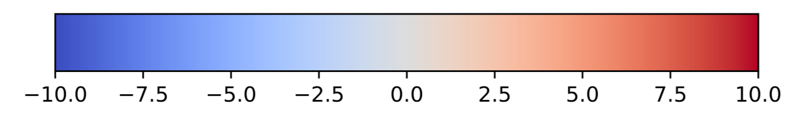

# Running ORFold:

## Advanced run:

### Mapping of the fold potential and the disorder and aggregation propensities along the genome of an organism

In the previous section we presented how to launch ORFold on a set
of amino acid sequences stored in a FASTA file. However, 
the originality of ORFold relies on the fact that the user can manually 
inspect the distribution of the properties estimated with ORFold (fold potential,
and disorder and aggregation propensities) along a genome of interest. 
In this case, the user must provide the genome annotation file (GFF) along with 
the input FASTA file. ORFold will return new GFF files (one per studied property)
that contain for the ORFs provided in the input FASTA file, their corresponding 
property (fold potential, disorder or aggregation propensities). The 
values are stored in the column #9 of the output GFF files. The GFF files can be subsequently
uploaded on a genome viewer such as IGV [1].

The input GFF file must be given with the **-gff** option as follows:

```{}
orfold -fna sequences.fasta -options HIT -gff sequences.gff 
```

ORFold generates a **sequences.tab** file containing the fold potential, and the 
disorder and aggregation propensities of each sequence present in the input FASTA file.
Additionally, ORFold produces three new GFF files:

 1. sequences_HCA.gff
 2. sequences_IUPRED.gff
 3. sequences_TANGO.gff

The output GFF files are identical to the one provided by the user except that for the sequences present
at the same time in the FASTA and the GFF files that were given as inputs, the column #9
is now replaced by the fold potential, or the disorder or aggregation propensities estimated by ORFold.
That way, the corresponding sequences can be colored according to these values on
a genome viewer, thereby enabling the visual inspection of these properties along
the input genome. Notice that on IGV, blue indicates low values (for all mapped properties) 
while red indicates high values. 

 <br>
<em>Figure 1: Color scale for the HCA score values 
</em>

<div class="admonition note">
    <p class="first admonition-title">
        Note
    </p>
    <p class="last">

Notice that the ID 
of the sequences given in the FASTA file (i.e. annotation after the ">" in 
the FASTA file) must be strictly identical to those of the corresponding sequences 
in the GFF file (i.e. ID indicated in the column #3 of the GFF file).  
         
    </p>
</div>

### Dealing with multiple files at the same time:

ORFold can handle multiple input files (FASTA and GFF) and will associate 
the FASTA and GFF files according to the following rules:

1. If the user provides the same number of FASTA and GFF files, ORFold associates them 
   based on their root name, no matter the order of the files.

		orfold -fna sequences_Y.fasta sequences_X.fasta -options H -gff sequences_X.gff sequences_Y.gff
	
	In this case, ORFold associates:

	* sequence_Y.fasta with sequence_Y.gff
	* sequence_X.fasta with sequence_X.gff 
	
	&nbsp;
	

2. I If the user provides the same number of FASTA and GFF files,
   but their root names are not identical, ORFold associates them 
   according to the order of the files in the command line.

		orfold -fna sequences_Y.fasta sequences_X.fasta -options H -gff sequences_A.gff sequences_B.gff

	In this case, ORFold associates:

	* sequence_Y.fasta with sequence_A.gff
	* sequence_X.fasta with sequence_B.gff

	&nbsp;

3. If the user provides multiple FASTA files and only one GFF file, then:

	* If the name of the GFF file matches with the name of one of the FASTA files,
	  the two files are associated, while the other FASTA files are not associated
	  to the input GFF file.
		
			orfold -fna sequences_Y.fasta sequences_X.fasta -options H -gff sequences_X.gff

		ORFold associates:
	
		* sequences_X.fasta with sequences_X.gff
		* sequences_Y.fasta with **nothing**
		
		&nbsp;

	* If the name of the GFF file does not match with any of the names of 
	  the FASTA files, then the GFF file will be associated with all the FASTA
	  files, considering that the FASTA files correspond to different 
	  subgroups of the same dataset.
			
			orfold -fna sequences_Y.fasta sequences_X.fasta -options H -gff sequences_B.gff

		ORFold associates:

		* sequences_Y.fasta with sequences_B.gff
		* sequences_X.fasta with sequences_B.gff
		
		&nbsp;

4. If the user provides multiple FASTA and GFF files (but not the same number)
   , all GFF files must have a corresponding FASTA file with the same root name. 
   Otherwise, ORFold will give an ERROR message. 

		orfold -fna sequences_Y.fasta sequences_X.fasta sequences_Z.fasta -options H -gff sequences_Z.fasta sequences_Y.gff

	ORFold associates:

	* sequences_Y.fasta with sequences_Y.gff
	* sequences_Z.fasta with sequences_Z.gff
	* sequences_X.fasta with nothing
	
	&nbsp;

		orfold -fna sequences_Y.fasta sequences_X.fasta sequences_Z.fasta -options H -gff sequences_B.fasta sequences_A.gff

	ORFold will give the following error message:
		
		Oups! You provided GFF file(s) which has/have no correspondance to the input FASTA files

###  Running ORFold on subsets of randomly selected sequences 
Working with complete genomes could generate big amounts of sequences 
which can dramatically increase the computational time of ORFold when dealing with
large genomes (especially if the estimation of the disorder and aggregation propensities are
activated). If the user does not want to treat all 
the sequences, he can create a random sample of the input sequences, large enough
 to have an estimation of the distribution of the studied properties of its 
dataset from a representative sample of the input sequences. To do so, 
the user must indicate the number of sequences that are to be randomly selected
with the **-N** option. For a representative dataset, we recommend selecting at least
10000 sequences.

	orfold -fna sequences.fasta -options HIT -gff sequences.gff -N 10000

In this example, ORFold will estimate the fold potential, and the disorder and 
aggregation propensities on a sample of 10000 sequences extracted randomly 
from the initial **sequences.fasta** file.    

<div class="admonition note">
    <p class="first admonition-title">
        Note
    </p>
    <p class="last">
	
	If the user works with more than one FASTA file and wishes to create 
	random samples for all the input sequence files, he has to indicate in 
	the -N option the size for each input file explicitly (in the same order 
	as the inputs passed in the -fna option).
	<br>
```{}
orfold -fna sequences_X.pfasta sequences_Y.pfasta -options H -N 1500 3000
```	
Also, if the user wants to sample two subsets of same sizes, he has to indicate the subset sizes explicitly for each input
```{}
orfold -fna sequences_X.pfasta sequences_Y.pfasta -options H -N 1500 1500
```
	If the user whishes to calculate the fold potential of all the sequences 
	of one of the given inputs, he has to indicate it with the "all" flag (again with respect to
    the order of input files)
```bash
orfold -fna sequences_X.pfasta sequences_Y.pfasta -options H -N all 3000
```
In this case, ORFold will calculate the fold potential for <b>all</b> the sequences 
in the sequences_X file while will generate a random sample of 3000 sequences for the 
sequences_Y file.   
	
    </p>
</div>

References

1. Robinson JT, Thorvaldsdóttir H, Winckler W, et al (2011)
   Integrative genomics viewer. Nature biotechnology 29:24–26