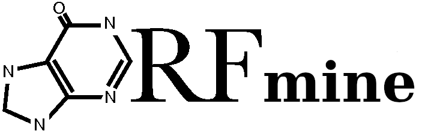

    
    

    Chris Papadopoulos1, Nicolas Chevrollier2, Hugo Arbes1, Paul Roginski1, Anne Lopes1
    

Affiliations

    

        

            1 Université Paris-Saclay, CEA, CNRS, Institute for Integrative Biology of the Cell (I2BC), 91198, Gif-sur-Yvette, France, <a href=mailto:anne.lopes@i2bc.paris-saclay.fr>anne.lopes@i2bc.paris-saclay.fr</a>,
            <a href=mailto:cgpapado.bio@gmail.com>cgpapado.bio@gmail.com</a>,
            <a href=mailto:arbes.bioinfo@gmail.com>arbes.bioinfo@gmail.com</a>.
        

        

            2 Independent bio-informatician, Paris, France, <a href=mailto:nicolas.chevrollier@laposte.net>nicolas.chevrollier@laposte.net</a>.
        

    

OMICS studies attribute a new role to the noncoding genome in
the production of novel peptides. The widespread transcription
of noncoding regions and the pervasive translation of the resulting
RNAs offer a vast reservoir of novel peptides to the organisms.

ORFmine[1][2] is an open-source package that aims at extracting, annotating,
and characterizing the sequence and structural properties of
all Open Reading Frames (ORFs) of a genome (including coding and
noncoding sequences) along with their translation activity. ORFmine consists of several independent programs,
[**ORFtrack**](#anchor-orftrack), [**ORFold**](#anchor-orfold), [**ORFribo**](#anchor-orfribo), and [**ORFdate**](#anchor-orfdate), that can be used together or independently
(see [here](./orfmine_quickstart.md) for an example of
application).

    

[ { width=30% }](./orftrack_description.md)  

ORFtrack searches for all possible ORFs longer than 60 nucleotides in the six frames of an input
genome, and annotate them according to a set of genomic features
(e.g. noncoding intergenic ORFs, coding ORFs, noncoding ORFs
that overlap with a specific genomic feature...). It provides
the user with a GFF file containing the annotations of all identified ORFs
that can be directly uploaded on a genome viewer for a visual inspection.
In addition, their amino acid and/or nucleotide sequences can be extracted
in a FASTA file (for more details, see the complete
documentation of ORFtrack).
 

[{ width=30% }](./Objective_orfold.md)  

ORFold predicts the fold potential and the disorder and aggregation
propensities of a set of amino acid sequences (all ORFs annotated by ORFtrack for example or any set of amino acid sequences provided with a FASTA file).
The fold potential is estimated with the HCA method [3], while the
disorder and aggregation propensities are calculated with IUPRred[4][4][6], and
TANGO[7][8][9] respectively. The specificity of ORFold lies
in the fact that the user can provide the amino acid sequences along
with their corresponding annotations in a GFF file. In this
case, ORFold produces new GFF files, each containing for each annotated
sequence, their fold potential, disorder and aggregation propensities
respectively, thereby enabling the manual inspection of these
properties along a genome in a genome viewer
(for more details, see the complete
documentation of ORFold).
 

[{ width=30% }](./orfribo_objectives.md)  

ORFribo probes the translation activity of a set of ORFs of a genome based on Ribosome Profilng data (Ribo-Seq). ORFribo is very flexible and handles any type of ORFs once annotated in a GFF file (e.g. coding sequences, alternative ORFs (i.e., noncoding ORFs located in the alternative frames of CDSs) or intergenic ORFs). ORFribo has no a priori and does not predict any ORF status (translated or not for instance), but rather calculates for each ORF, the counts of reads that map on it along with the frame they are associated with (i.e., the frame of the ORF, or its two alternative frames), thereby providing information that can be indicative on the specificity of the translation of the ORF. The raw information is provided in a text table very easy to parse so that, the user is free to set its own thresholds (number of reads, specificity of translation (i.e. number of reads that are in the frame of the ORF)) to classify ORFs based on their translation signals and/or extract interesting candidates. In order to increase the read coverage of noncoding regions, expected to be low because they are usually associated with lower expression when expressed, ORFribo enables one to pool multiple Ribo-Seq datasets. Reads of good quality (quality thresholds are customizable by the user) of all datasets are thus merged together and the resulting signal is analyzed as a whole and provided as a single output table. The user is free to combine different datasets as he/she whishes (experiments performed in specific conditions, tissues etc).
 

[{ width=30% }](./orfdate_objectives.md)  

ORFdate estimates the evolutionary age (in Mya) of a set of ORFs of a genome (coding or noncoding ORFs) based on phylostratigraphy.
 
 
 

#### References

1. Papadopoulos, C., Chevrollier, N., Lopes, A. Exploring the peptide potential of genomes. Meth. Mol. Biol. (2022).
2. Papadopoulos, C., Arbes, H., Chevrollier, N., Blanchet, S., Cornu, D., Roginski, P., Rabier, C., Atia, S., Lespinet, O., Namy, O., Lopes, A. (submitted).
2. Bitard-Feildel, T. & Callebaut, I. HCAtk and pyHCA: A Toolkit and Python API for the Hydrophobic Cluster Analysis of Protein Sequences. bioRxiv 249995 (2018).
3. Dosztanyi, Z., Csizmok, V., Tompa, P. & Simon, I. The pairwise energy content estimated from amino acid composition discriminates between folded and intrinsically unstructured proteins. Journal of molecular biology 347, 827–839 (2005).
4. Dosztányi, Z. Prediction of protein disorder based on IUPred. Protein Science 27, 331– 340 (2018).
5. Mészáros, B., Erdős, G. & Dosztányi, Z. IUPred2A: context-dependent prediction of protein disorder as a function of redox state and protein binding. Nucleic acids research 46, W329–W337 (2018).
6. Fernandez-Escamilla, A.-M., Rousseau, F., Schymkowitz, J. & Serrano, L. Prediction of sequence-dependent and mutational effects on the aggregation of peptides and proteins. Nature biotechnology 22, 1302–1306 (2004).
7. Linding, R., Schymkowitz, J., Rousseau, F., Diella, F. & Serrano, L. A comparative study of the relationship between protein structure and β-aggregation in globular and intrinsically disordered proteins. Journal of molecular biology 342, 345–353 (2004).
8. Rousseau, F., Schymkowitz, J. & Serrano, L. Protein aggregation and amyloidosis: confusion of the kinds? Current opinion in structural biology 16, 118–126 (2006).
