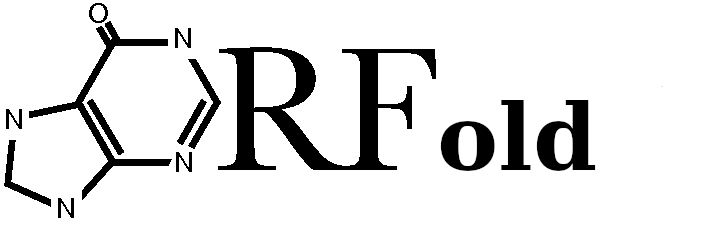

Chris Papadopoulos1, Nicolas Chevrollier2, Anne Lopes1

Affiliations

    

        

            1 Université Paris-Saclay, CEA, CNRS, Institute for Integrative Biology of the Cell (I2BC), 91198, Gif-sur-Yvette, France, <a href=mailto:anne.lopes@i2bc.paris-saclay.fr>anne.lopes@i2bc.paris-saclay.fr</a>, 
            <a href=mailto:cgpapado.bio@gmail.com>cgpapado.bio@gmail.com</a>.
        

        

            2 Independent bio-informatician, Paris, France, <a href=mailto:nicolas.chevrollier@laposte.net>nicolas.chevrollier@laposte.net</a>.
        

    

    

Recent studies attribute a new role to the noncoding genome in
the production of novel peptides. The widespread transcription
of noncoding regions and the pervasive translation of the resulting
RNAs offer a vast reservoir of novel peptides to the organisms.

ORFmine is an open-source package that aims at extracting, annotating,
and characterizing the fold potential and the structural properties of
all Open Reading Frames (ORF) encoded in a genome (including coding and
noncoding sequences). ORFmine consists of two independent programs, 
<b>ORFtrack</b> and <b>ORFold</b> that can be used together or independently
(see [here](./orfmine_quickstart.md) for an example of 
application).

 
[ { width=30% }](./orftrack_description.md)  

ORFtrack searches for all possible ORFs longer than 60 nucleotides in the six frames of an input
genome, and annotate them according to a set of genomic features 
(e.g. noncoding intergenic ORFs, coding ORFs, noncoding ORFs 
that overlap with a specific genomic feature...). It provides
the user with a GFF file containing the annotations of all identified ORFs
that can be directly uploaded on a genome viewer for a visual inspection.
In addition, their amino acid and/or nucleotide sequences can be extracted 
in a FASTA file (for more details, see the complete 
documentation of ORFtrack).

 
[{ width=30% }](./Objective_orfold.md)  

ORFold probes the fold potential and the disorder and aggregation 
propensities of a set of amino acid sequences (all ORFs annotated by ORFtrack for example).
The fold potential is estimated with the HCA method [1], while the
disorder and aggregation propensities are calculated with IUPRred[2][3][4], and
TANGO[5][6][7] respectively. The specificity of ORFold lies
in the fact that the user can provide the amino acid sequences along 
with their corresponding annotations in a GFF file. In this
case, ORFold produces new GFF files, each containing for each annotated
sequence, their fold potential, disorder and aggregation propensities 
respectively, thereby enabling the manual inspection of these 
properties along a genome in a genome viewer
(for more details, see the complete 
documentation of ORFold).

 
#### References

1. Bitard-Feildel, T. & Callebaut, I. HCAtk and pyHCA: A Toolkit and Python API for the Hydrophobic Cluster Analysis of Protein Sequences. bioRxiv 249995 (2018).
2. Dosztanyi, Z., Csizmok, V., Tompa, P. & Simon, I. The pairwise energy content estimated from amino acid composition discriminates between folded and intrinsically unstructured proteins. Journal of molecular biology 347, 827–839 (2005).
3. Dosztányi, Z. Prediction of protein disorder based on IUPred. Protein Science 27, 331– 340 (2018).
4. Mészáros, B., Erdős, G. & Dosztányi, Z. IUPred2A: context-dependent prediction of protein disorder as a function of redox state and protein binding. Nucleic acids research 46, W329–W337 (2018).
5. Fernandez-Escamilla, A.-M., Rousseau, F., Schymkowitz, J. & Serrano, L. Prediction of sequence-dependent and mutational effects on the aggregation of peptides and proteins. Nature biotechnology 22, 1302–1306 (2004).
6. Linding, R., Schymkowitz, J., Rousseau, F., Diella, F. & Serrano, L. A comparative study of the relationship between protein structure and β-aggregation in globular and intrinsically disordered proteins. Journal of molecular biology 342, 345–353 (2004).
7. Rousseau, F., Schymkowitz, J. & Serrano, L. Protein aggregation and amyloidosis: confusion of the kinds? Current opinion in structural biology 16, 118–126 (2006).
