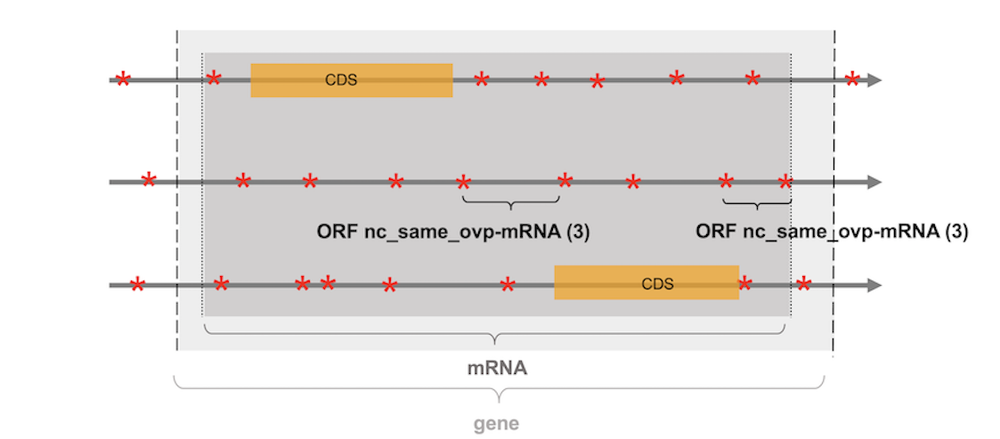

## ORF annotation

The ORF annotation relies on the comparison of their localization
with those of all the genomic features annotated in the input GFF 
file (e.g. coding sequences (CDS), tRNA, lncRNA, snoRNA, 
pseudogenes...). ORFs are subsequently assigned as coding (c_CDS)
(if they include in the same frame a CDS) or noncoding (nc). 
Noncoding ORFs are then subdivided into 
noncoding intergenic ORFs (nc_intergenic) or noncoding overlapping
ORFs (nc_ovp-x with x refering to the overlapping genomic feature)
(see [here](./orfmap_overlap.md) for the definition of an overlap).
The former correspond to ORFs which do not overlap with any 
genomic feature. The latter consist of ORFs
which overlap with a non-phased genomic feature (i.e. non coding) 
on the same or the opposite
strand or which overlap with a CDS in another frame. 
Depending on the localization of the overlapping feature (same or
opposite strand), the ORFs are annotated as nc_ovp_same-x or 
nc_ovp_opp-x respectively.

    

        Note
    

    

Notice that the ORFmap annotation adopts/has a particular point of
view on the genome which is centered on the identification and
annotation of a genome's ORFs rather than the annotation of 
real biological objets (e.g. tRNA, rRNA or lncRNA for example). 
ORFmap looks at the genome with a protein perspective where
the ORFs of a genome can be seen as its potential for novel peptides or 
proteins upon the pervasive translation of their corresponding RNAs.

### Annotation rules

#### ORF categories 
ORFs can be annotated according to four different categories:

* (1) `c_CDS` ORFs which include in the same frame a CDS 
* (2) `nc_intergenic` ORFs which do not overlap any genomic feature 
* (3) `nc_ovp_same-x` ORFs which overlap on the same strand, with a genetic feature no matter 
  its type
* (4) `nc_ovp_opp-x` ORFs which overlap on the opposite strand, with a genetic feature no matter 
  its type
  
See examples of each type in Figure 1.

  
<em>Figure 1: representation of the six frames of a DNA section. STOP codons
are represented with red stars, CDS with orange boxes and 
 the localization of the non-phased genomic features 
 (e.g. tRNA, lncRNA) are represented with green boxes. </em>

    

        Note
    

    

       Notice that a noncoding ORF which overlaps with a tRNA is not 
considered as a tRNA and will not be annotated as tRNA, but rather
as an ORF that overlaps with a tRNA. Indeed a tRNA is a RNA 
molecule that does not follow the ORF definition (not bounded by STOP 
codons, whose sequence length is not necessarily a multiple of 3...).
Here ORFs are seen as potential peptides or proteins that could be 
produced upon the pervasive translation of their corresponding RNA.
Annotating all ORFs with the genomic feature they overlap with 
enables their analysis in a very flexible fashion.
Indeed, the user can adopt different levels of annotation, 
considering all noncoding ORFs as a whole (i.e. regardless of the fact they
overlap with a genomic feature or not) or differentiating noncoding ORFs
from noncoding ORFs that overlap with specific genomic features (e.g. 
tRNA and rRNA) (see the <a href="./orfget_run.html">ORFget section</a>  
for more details).

    

#### Priority rules

If a noncoding ORF overlaps with multiple genomic features, 
it will be annotated according to the following priority rules:

 1. if the noncoding ORF overlaps with a CDS and another annotated 
    feature, the CDS has priority over the other annotated features
    no matter the CDS is located on the same or the opposite strand.
    The ORF will be annotated as a noncoding ORF overlapping with 
    a CDS (e.g. nc_ovp_(same/opp)-CDS).
    

2. if the noncoding ORF overlaps with an annotated feature on the 
   same strand and another annotated feature on the opposite 
   strand (except CDS), the annotated feature located on the same strand
   has priority over the other features on the opposite
   strand. The ORF will be annotated as a noncoding ORF overlapping 
   with the feature on the same strand (e.g. nc_ovp_same-x).

3. if the noncoding ORF overlaps with multiple annotated features
   located on the same strand, the feature with the larger overlap
   with the ORF to be annotated has priority over the other features
   (e.g. nc_ovp_(same/opp)-x).
   
4. if the noncoding ORF overlaps with multiple features located on the 
same strand and that cover the same fraction of the ORF to be 
   annotated, the feature which first appears in the GFF file has
   priority over the others. This case occurs with large annotated 
   features that embed smaller elements. 
   

   Particular case of genes and exons. Notice that many genomic 
   features overlap together or can be intertwined with each other 
   (e.g. a gene includes
   one or several mRNAs which in turn include exons and CDS). By default, 
the features "gene" and "exon" are not considered. ORFs that
match at the same time with the features "gene" and "mRNA" are annotated
as nc_(same/opp)\_ovp-mRNA (see Figure 2), while those that match with a CDS
and its corresponding exon, will be annotated as c_CDS (i.e. coding 
   ORFs). Finally, noncoding ORFs that overlap in another frame with 
   a CDS, and an exon will be annotated as nc_(same/opp)\_ovp-CDS.
   

  
<em>Figure 2: representation of the three frames of a DNA strand section 
 containing a protein coding gene. 
 STOP codons are represented with red stars, 
 the two CDS of the multiexonic gene with orange boxes, while 
 the protein coding gene and its corresponding mRNA are 
 represented with light and dark grey boxes respectively.
The two ORFs indicated with brackets do not overlap with the CDS
 of the gene and are subsequently annotated as noncoding. However,
 they overlap with the gene and its corresponding mRNA. As the mRNA has priority
over the gene feature, the two ORFs are annotated as noncoding ORF
overlapping with a mRNA (nc_ovp_same-mRNA).
 </em>

