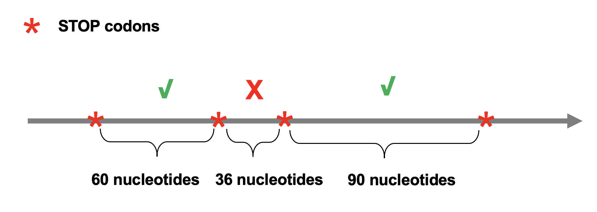

## ORF definition

ORFs are defined according to the recent definition proposed
by [Sieber et al, ](https://doi.org/10.1016/j.tig.2017.12.009) in 
2018.

An ORF:

 * has a length divisible by 3
 * is bounded by stop codons
 * is at least 60 nucleotides long (STOP codons excluded)




The minimal length of an ORF can be nevertheless modified by the user with
the **-orf_len** parameter (notice that the ORF length does not
include the
STOP codons). The following instruction extracts all ORFs of at least 
100 amino acids: 


``` bash
orftrack -fna /database/genome.fasta -gff /database/genome.gff -orf_len 300 
```


