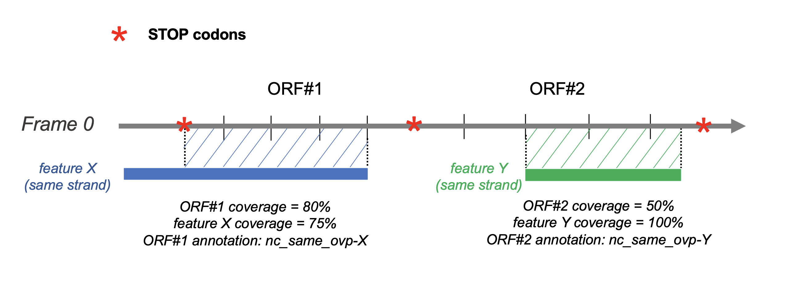

## Overlap definition

Calculation of the overlap:

* An ORF is considered as overlapping a given genomic feature
  if the latter covers at least 70% of the ORF sequence.

* If less than 70% of an ORF sequence overlaps a genomic
   feature,
   but the latter is totally included in the ORF sequence, 
   then the ORF is also considered as overlapping it.



Notice that the overlap threshold can be modified with the **-co_ovp**
parameter. With the following instruction, an ORF is annotated 
as overlapping a given genomic feature if the latter covers at least 
90% of the considered ORF.


``` bash
orftrack -fna /database/genome.fasta -gff /database/genome.gff -co_ovp 0.90 
```

