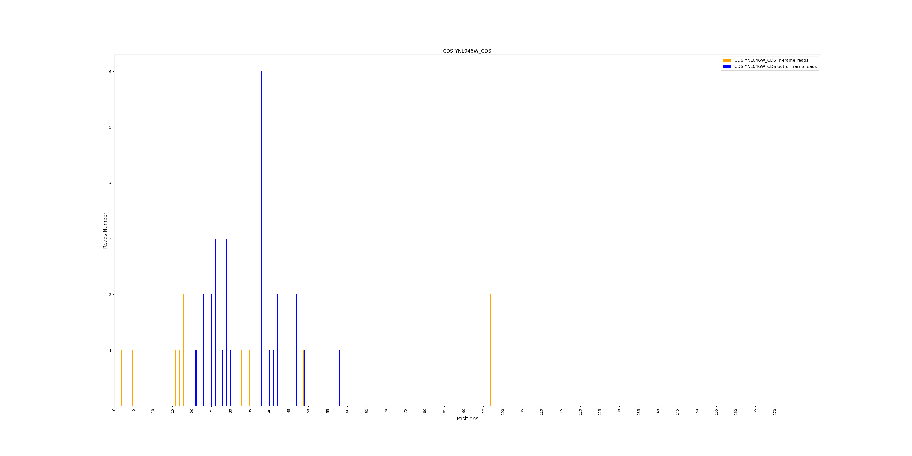
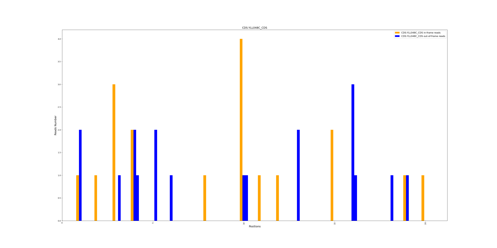
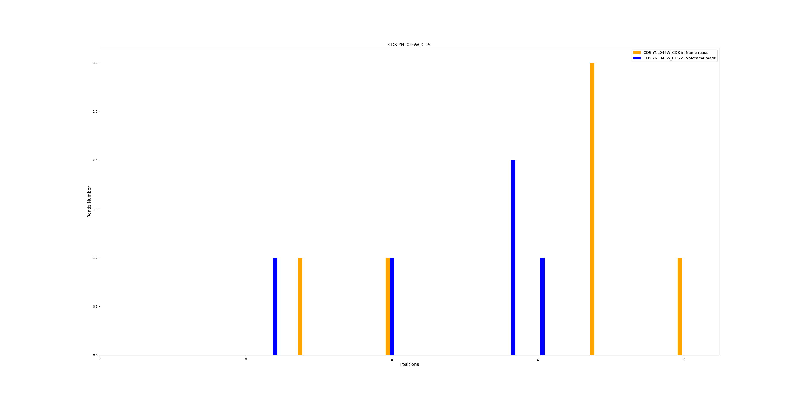

# CDS Periodicity Plot Utility

## Overview 
This script is an additional tool for **ORFribo**, located in the **Extra_Scripts** directory on **Github**. It visualizes peridicity in ribosome profiling data. It generates bar plots showing in-frame and out-of-frame ribosome occupancy across coding sequences (CDS).


## Installation Requirements 

Before running the script, ensure that the following Python packages are installed. 

**Note**: This script cannot be executed inside a container because the package versions are not compatible with the script.

```bash
pip install matplotlib pandas numpy
```
## Usage 

### **1. Individual Mode (Single File)**  
To generate a periodicity plot from a single `.tab` file:

```bash
python metagenome_plotting.py --individual --tab path/to/file.tab --cds_name CDS001
```

Parameters:

`--individual` : Enables individual mode.

`--tab` : Path to the Exome_XX_periodicity_all.tab  **.tab** file.

`--cds_name` : Name of the CDS to analyze.
 


### 2. Processing multiple CDS from a File

If you have multiple *.tab* and multiple CDS names in a text file, use: 

```bash 
python metagenome_plotting.py --pooled --directory path/to/directory --cds_file cds_list.txt 
```

Parameters:

`--cds_file` : Path to a text file containaing one CDS name per line.

`--pooled` : Enables pooled mode to process multiple files.

`--directory`:  Path to the directory containing multiple Exome_XX_periodicity_all.tab **.tab** files.


## Output 

The script generates **bar plots** where:  

- **Orange bars**: In-frame reads (P0).  
- **Blue bars**: Out-of-frame reads (P1 & P2).  

The plot is saved as a `.png` file with the **CDS name**.


## Example : 

### 1. Individual Mode (Single File):

```bash
python3 metagenome_plotting.py --individual --tab Exome_28_periodicity_all.tab --cds_name YNL046W 

-------

Individual mode selected...
Looking for: CDS:YNL046W_CDS
Processing file: Exome_28_periodicity_all.tab
Plot saved to YNL046W.png


```




### 2. Multiple files : 

```bash
python3 metagenome_plotting.py --pooled --directory Tabs/ --cds_file cds.txt --nb_cds 20


-------
Pooled mode selected...
Looking for: CDS:YLL048C_CDS
Processing file: Tabs/Exome_30_periodicity_all.tab
Processing file: Tabs/Exome_29_periodicity_all.tab
Processing file: Tabs/Exome_28_periodicity_all.tab
Plot saved to YLL048C_pooled.png
Looking for: CDS:YNL046W_CDS
Processing file: Tabs/Exome_30_periodicity_all.tab
Processing file: Tabs/Exome_29_periodicity_all.tab
Processing file: Tabs/Exome_28_periodicity_all.tab
Plot saved to YNL046W_pooled.png

```


``--nb_cds 20 ``: argument limits the number of CDS processed by the script.

``cds.txt``: file containaing one CDS name per line: 

```bash
YLL048C
YNL046W
```

**YLL048C_pooled.png** 





**YNL046W_pooled.png**




