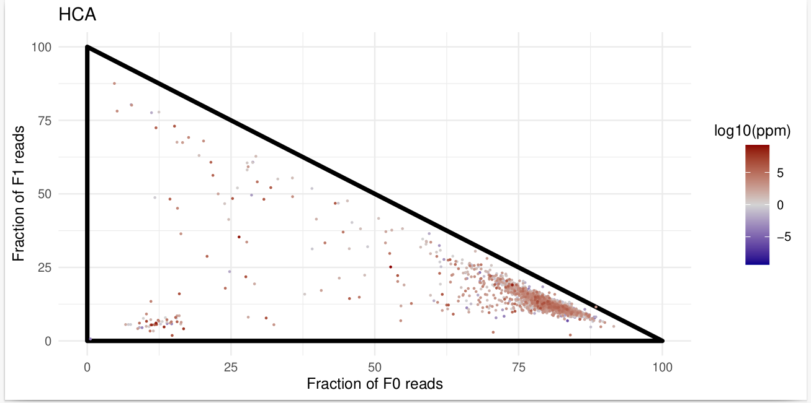

#  Triangle Plot for Ribosome Profiling Data

## **Overview**  
This script is an additional tool for **ORFribo** located in the **Extra_Scripts** directory on **Github**. It visualizes periodicity and translation efficiency in ribosome profiling data.  
It generates a **triangle plot** that helps analyze in-frame and out-of-frame ribosome occupancy across coding sequences (CDS).


## **Installation & Dependencies**  
The script automatically checks for and installs missing dependencies. If you want to ensure all required packages are installed manually, run:

```bash
install.packages(c("ggplot2", "ggbeeswarm", "ggpubr", "plotrix", "RColorBrewer", "ineq", 
                    "ggExtra", "ggridges", "proxy", "dplyr", "seqinr", "stringr"), 
                 repos = "http://cran.rstudio.com/")
```
                 
                                  
## Usage 

### 1. Running the Script 

To execute the script from the command line:

```bash
Rscript triangle_plot.R input_data.csv output_plot.pdf feature_column blue grey red
```

Parameters: 

`input_data.csv`: Path to the input CSV file.

`output_plot.pdf`: Path to the output PDF file.

`blue grey red` : (Optional) Colors for low, mid, and high intensity.

### 2. Example : 

```bash
Rscript triangle_plot.R data.csv output.pdf HCA "darkblue" "lightgrey" "darkred"
```



