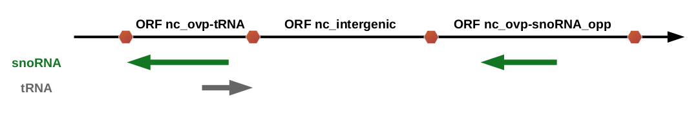
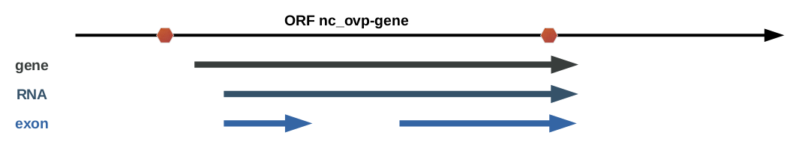

## ORF annotation

All ORFs are annotated according to their potential overlapping GFF element(s).
Globally, an ORF can be assigned either as a non-coding (nc) sequence or a coding (c) sequence.

### Non-coding ORF sequences

All GFF elements present in both strands are used to define if an ORF is overlapping or not. Thus, 
non-coding ORF sequences have three possible feature types:

* `nc_intergenic` if the ORF sequence has no overlapping GFF element
* `nc_ovp-element_type` if the ORF sequence overlaps with a GFF element in the same strand
* `nc_ovp-element_type-opp` if the ORF sequence overlaps with a GFF element in the opposite strand

For instance, if an ORF sequence overlaps with a tRNA, the ORF type will be `nc_ovp-tRNA`.

If an ORF sequence overlaps with multiple GFF elements, the one that will be considered to annotate 
the ORF is the one prioritized according to the following rules:

 1. an element on the same strand has the priority over an element on the opposite strand
   
 2. an element with which the ORF sequence overlaps the most has the priority over other elements
   
 3. the element appearing the first in the GFF file has the priority 
   

If an ORF sequence overlaps with multiple GFF elements, the ORF type will be assigned according to
the overlapping element with wich it overlaps the most. If the ORF overlaps equally with multiple 
elements, then it will be arbitrarily assigned according to the first element met in the GFF file.

 