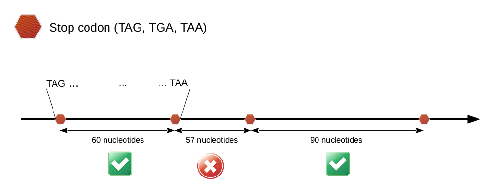

## ORF defintion

ORFMap searches all potential ORFs for a given genome. To do so, an ORF has been defined
according to its most general definition (https://doi.org/10.1016/j.tig.2017.12.009).
An ORF sequence:

 * has a length divisible by 3
 * is bounded by stop codons
 * is at least 60 nucleotides long (stop codons included)

