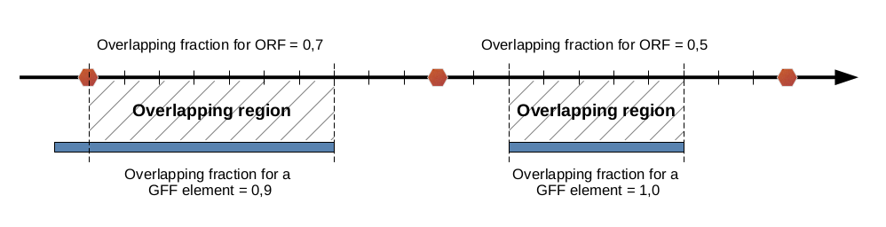

## Overlap defintion
All ORFs sequences are annotated according to the element(s) they could overlap with.
The overlap definition is as follow:

* If at least 70 % of an ORF sequence overlaps with a GFF element, then the ORF is considered
as overlapping with this element.

 * If less than 70 % of an ORF sequence overlaps with a GFF element, but this element is 
totally included in the ORF sequence, then the ORF is considered as overlapping with
the element.

